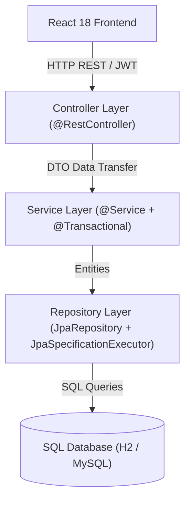

# Smart Campus 360 - Architecture & Code Audit Review

## 1. System Overview
**Smart Campus 360** is an enterprise campus management and emergency distress telemetry platform designed using **Spring Boot 3.3.x (Java 21)** for backend REST microservices and **React 18** for a glassmorphic dashboard interface.

---

## 2. Layered Architecture & Component Breakdown

1. **Controller Layer**: REST controllers validating request DTOs and enforcing `@PreAuthorize` authority scoping.
2. **Service Layer**: Manages business logic, transaction boundaries (`@Transactional`), status history, and append-only audit logging.
3. **Repository Layer**: Extends `JpaRepository` and `JpaSpecificationExecutor` for dynamic Criteria API queries, pagination, and sorting.
4. **Security Layer**: `JwtAuthenticationFilter` intercepts requests, parses bearer tokens, and populates `SecurityContextHolder`.

---

## 3. Security & Access Control Matrix

| Role | Access Scope | Protected Endpoints |
| :--- | :--- | :--- |
| `ROLE_ADMIN` | Full System Administration | `/api/admin/**`, `/api/reports/**`, Audit Logs |
| `ROLE_FACULTY` | Academic Management & Mentorship | `/api/faculty/**`, Mentees, Grades, Leave Reviews |
| `ROLE_STUDENT` | Own Profile & Self Services | `/api/student/**`, Service Requests, Complaints |
| `ROLE_SECURITY` | Emergency Response & Telemetry | `/api/emergency/**`, SOS Alerts |

---

## 4. Audit & Performance Optimization Guidelines
- **DTO Isolation**: Entities are never exposed directly to clients.
- **N+1 Prevention**: JPA `@ManyToOne` relationships use `FetchType.LAZY`.
- **Append-Only Auditing**: Every write operation logs an immutable record in `AuditLog`.
- **Status Telemetry**: Transition history recorded in `StatusHistory`.
