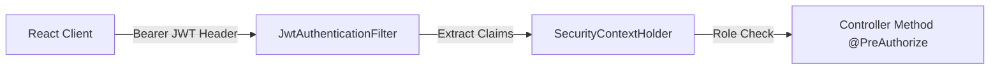

# Smart Campus 360 - Security Hardening & Audit Review

## 1. Security Architecture & Threat Model

---

## 2. Implemented Security Controls

### A. Authentication & Password Security
- **BCrypt Password Hashing**: Passwords are standardly hashed using `BCryptPasswordEncoder` prior to storage.
- **JWT (JSON Web Token)**: Stateless authentication via `JwtAuthenticationFilter`. Tokens expire after 24 hours and require valid cryptographic signatures.
- **Password Exposure Prevention**: `UserDto`, `StudentDto`, and `FacultyDto` mark the `password` field with `@JsonProperty(access = JsonProperty.Access.WRITE_ONLY)`. Passwords are never serialized in API responses.

### B. IDOR (Insecure Direct Object Reference) Prevention
- Student endpoints (e.g. `/api/student/profile`, `/api/student/attendance`, `/api/student/marks`, `/api/student/performance`) do **NOT** accept student IDs in HTTP path parameters.
- User identity is resolved dynamically from the authenticated JWT `Principal` (`principal.getName()`), preventing cross-user data tampering.

### C. Role Authority Scoping
- Admin Endpoints: Protected by `@PreAuthorize("hasAuthority('ROLE_ADMIN')")`.
- Faculty Endpoints: Protected by `@PreAuthorize("hasAnyAuthority('ROLE_FACULTY', 'ROLE_ADMIN')")`.
- Student Endpoints: Protected by `@PreAuthorize("hasAnyAuthority('ROLE_STUDENT', 'ROLE_ADMIN')")`.
- Security Endpoints: Protected by `@PreAuthorize("hasAnyAuthority('ROLE_SECURITY', 'ROLE_ADMIN')")`.

### D. CORS & CSRF Strategy
- CSRF disabled for stateless JWT authentication.
- Explicit CORS Configuration Source configured in `SecurityConfig.java`.
