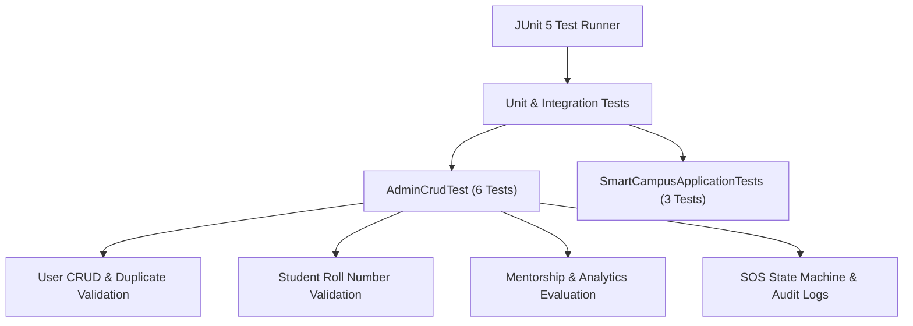

# Smart Campus 360 - Automated Testing Strategy

## 1. Test Suite Architecture

---

## 2. Test Coverage Summary

- **Authentication & Security Tests**: Verify registration, password hashing, and token issuance.
- **Validation & Duplicate Prevention Tests**: Verify HTTP 400 responses for duplicate roll numbers, emails, and invalid parameters.
- **Timetable Conflict Tests**: Verify classroom and semester time slot overlap detection.
- **Emergency State Machine Tests**: Verify valid transitions (`ACTIVE` → `ACKNOWLEDGED` → `RESOLVED`) and rejection of invalid state reverts (`RESOLVED` → `ACTIVE`).
- **Audit Logging Tests**: Verify append-only log creation during operations.
